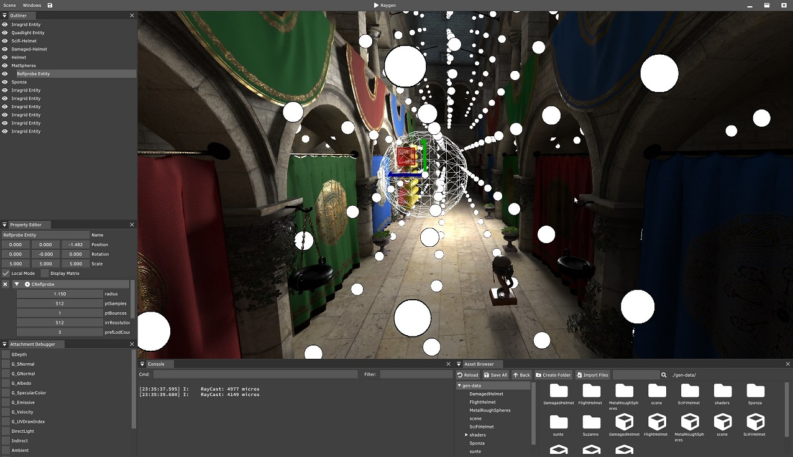

# Raygen

Raygen is a game engine focused on exploring real-time applications of ray tracing. Developed by two colleagues with a common interest and enthusiasm in the worlds of video games and software development. The engine is written in C++20 and uses the Vulkan API. 

## Requirements

* CMake: minimum version 3.16
* Visual studio 19: up until version 16.7.7 

## Getting started

```
git clone --recursive https://github.com/Renoras/Raygen
cd Raygen
mkdir build
cd build
cmake ..
cmake --build . --target Raygen-App --config Release
 ```

If you are using the .sln to build remember to change the startup project to Raygen.

## Dependencies (included as submodules)

_Links to original repos, even if we use our own slightly modified forks._

* [catch2](https://github.com/catchorg/Catch2)
* [cereal](https://github.com/uscilab/cereal)
* [entt](https://github.com/skypjack/entt)
* [glfw](https://github.com/glfw/glfw)
* [glm](https://github.com/g-truc/glm)
* [glslang](https://github.com/KhronosGroup/glslang)
* [imgui](https://github.com/ocornut/imgui)
* [imguicolortextedit](https://github.com/BalazsJako/ImGuiColorTextEdit)
* [magic_enum ](https://github.com/Neargye/magic_enum)
* [nativefiledialog](https://github.com/mlabbe/nativefiledialog)
* [nlohmann](https://github.com/nlohmann/json)
* [spdlog](https://github.com/gabime/spdlog)
* [spirv-cross](https://github.com/khronosgroup/spirv-cross)
* [stb](https://github.com/nothings/stb)
* [tinygltf](https://github.com/syoyo/tinygltf)

## Features Included

* Cpu and Gpu asset management (importing, caching, exporting to engine assets)
* Multi-window Imgui based editor
* Console support with console variables and functions
* Performance profiler with exportable information
* Asset and world component runtime reflection
* Asset runtime editing (eg. Material editing)
* Bruteforce pathtracer
* Stochastic pathtracer
* Hybrid renderer (rasterization / raytracing)
* Reflection/Irradiance probes
* Delta lights (spotlights, point lights, directional lights)
* Area lights (quad lights)
* Basic animations (rasterization)
* Raytraced mirror reflections
* Raytraced ambient occlusion
* Raytraced area lights - SVGF filtered 
* Light volumes (rasterization)
* Runtime customizable scenegraph hierarchy
* Entity component system for world entities
* Spirv Runtime Compiler
* Runtime shader editing with live updates
* Custom material editor with live preview
* Serialization (world, assets)

## Features that may come

* Acceleration structure updating (raytracing animation support)
* Dynamic pipeline generation and shader permutations
* Probe blending
* Hybrid transparency
* ASVGF
* Image diff-ing 
* Bechmarks
* World scripting and script components
* Audio system
* Physics 

## Images



 


## Authors

| Info | Role |
| ------|-----|
|**John Moschos**, [Renoras](https://github.com/Renoras)| Co-Founder, Programmer |
|**Vivian Katagi**, [vkatagi](https://github.com/vkatagi)| Co-Founder, Programmer |
